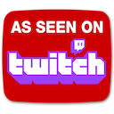

# Yalk!

## What is this?

Yalk is a self-hosted _"""Discord-like"""_ app, with many quotes as for now it only merely resembles the colours, but you get the intention.

It aims at literally nothing else than being just a multi-channel chat app, it honestly doesn't do anything special but it's built with passion, love and a lot of resentment towards my decision of starting coding.

At the bottom, a little bit of history and curious stuff about this project. :)

### Watch the project live!

I love writing code, comment it and chat with you people about it's developement and your suggestions (and lessons) but most importantly I love to do this because I can have my kittens nearby. Twitch is making it possible and I'm loving every second of it and having a lot of fun, but the channel remains dedicated to my two little loves of my live. You can check out [my Twitch Channel](https://twitch.tv/CoderCatz), don't be shy and join us in the chat! 💬

## Functions
Altough all the basic functions required by a text chat are in place more are set to come in future endeavours, for now here's an overview of what's currently available:

- **Channels**
  - Support for multiple users in a channel
  - Channel delete
  
- **Direct Messages**
  - Private chat 
  - Multiple user support
  
- **Statuses**
  - On-/Offline
  - Away
  - Busy
  
- **Users**
  - Custom display names
  - Profile pictures
  - Badge colors

Keep in mind this project was built with the idea of using the use of ***least possible dependencies***, as this served as a personal _learn-by-doing_ project.

## Setup
### Requirements
- Docker daemon installed
- PostgreSQL 13.0+ server/container

### Quickstart

The setup should be pretty straightforward, feel free to open a PR should there be any issue with the procedure.

1. [Install Docker](https://www.docker.com/products/docker-desktop/) for your OS
2. Open a Terminal/PowerShell
3. Pull Postgres image
  `docker pull postgres`
1. Run the PostgresSQL Server container
  `docker run -p 5432:5432 -e POSTGRES_PASSWORD=yourpostgrespass postgres` 
1. Get the container ID
   `docker ps`
2. Verify the Docker network IP Address for the container
  `docker inspect -f '{{range .NetworkSettings.Networks}}{{.IPAddress}}{{end}}' container_id`
1. Clone this repo in a user owned directory and enter the folder once finished
  `git clone https://github.com/Revengeic3/yalk-public.git`
1. Edit the `Dockerfile` in the package root folder setting the correct configuration
2. Generate certs and put them in **cert** folder
3.  Build the container image
  `docker build -f Dockerfile -t revengeic3/yalk:latest .`
1.   Run the container
  `docker run -p 8080:80 -p 4443:443 revengeic3/yalk:latest`
1.   Open your browser to your set address using HTTPS
2.   Login with Username 'admin' and Password 'admin'
3.   Works! 🚀

### Know Bugs and To-Do's
- [x] User goes offline automatically after 60 seconds
- [ ] Remove named returns
- [ ] Move functions to return errors and not interrupts the execution
- [ ] Manage initialization and errors in a single place (main.go?)
- [ ] Registration page (account creation)

..and many more! :)

## Important note ⚠️
This application should **NEVER** be run and actively used in Production, rather is to be intended **for educational purposes only**!

## Why does this exist?
Well first, this was

It comes from the "dream" of wanting to make two people communicate over the internet I had back in 2008 when I was a very young boy looking, which I could never realize due to my lack of knowlege and it took nearly 15 years for me to learn the skills and logic that allowed me to finally achieve it.

## Bibliography
Peterson, A. (2019, November 19). *What's the point of GoLang pointers? everything you need to know!* Medium. Retrieved 2022, from https://medium.com/@annapeterson89/whats-the-point-of-golang-pointers-everything-you-need-to-know-ac5e40581d4d 

..in progress
<ins>Readme is still **in progress**, this is just the barebone, apologies for the delays people ❤️ I'm mostly working on the citations and bibliograpgy</ins>